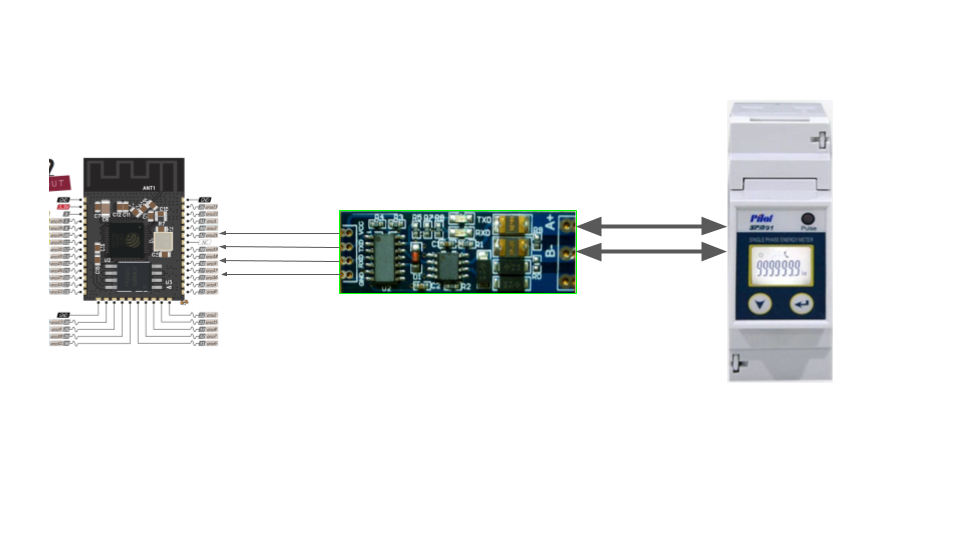
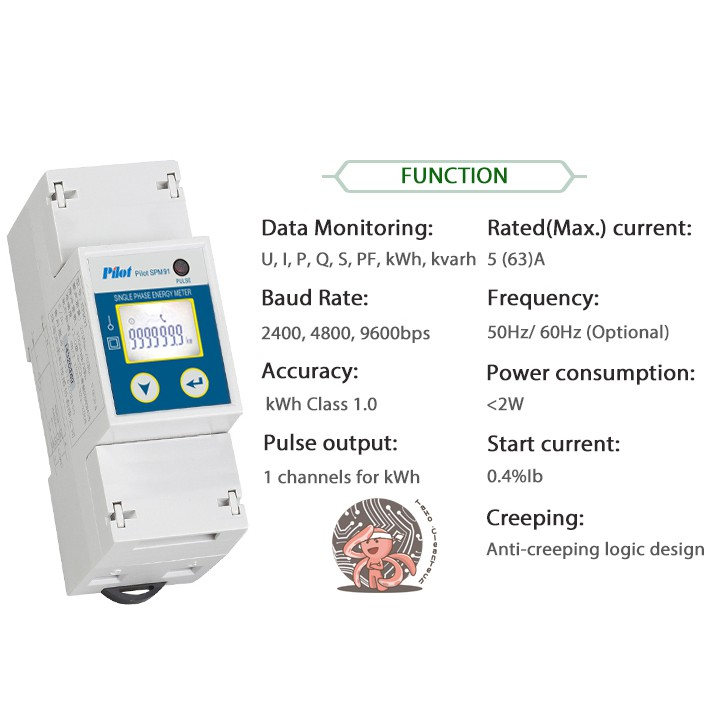

>>>>>  gd2md-html alert:  ERRORs: 0; WARNINGs: 0; ALERTS: 2.

<ul style="color: red; font-weight: bold"><li>See top comment block for details on ERRORs and WARNINGs. <li>In the converted Markdown or HTML, search for inline alerts that start with >>>>>  gd2md-html alert:  for specific instances that need correction.</ul>

Links to alert messages:
<a href="#gdcalert1">alert1</a>
<a href="#gdcalert2">alert2</a>

>>>>> PLEASE check and correct alert issues and delete this message and the inline alerts.

**ESP32_RS585_pilot_SPM92_mosbus_RTU**

**ตัวอย่างการใช้งาน**

>>>>>  gd2md-html alert: inline image link here (to images/image1.png). Store image on your image server and adjust path/filename/extension if necessary.  (<a href="#">Back to top</a>)(<a href="#gdcalert2">Next alert</a>) >>>>> 

ผมใช้เอา esp32 ต่อ rs485 กับตัว pilot SPM91 แล้วก็ทำตัวอย่างการเชื่อมต่อ modbus RTU 

**วิธีการต่อใช้งาน**

>>>>>  gd2md-html alert: inline image link here (to images/image2.png). Store image on your image server and adjust path/filename/extension if necessary.  (<a href="#">Back to top</a>)(<a href="#gdcalert3">Next alert</a>) >>>>> 

